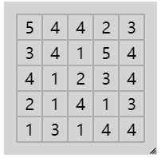
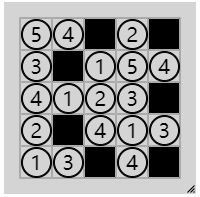
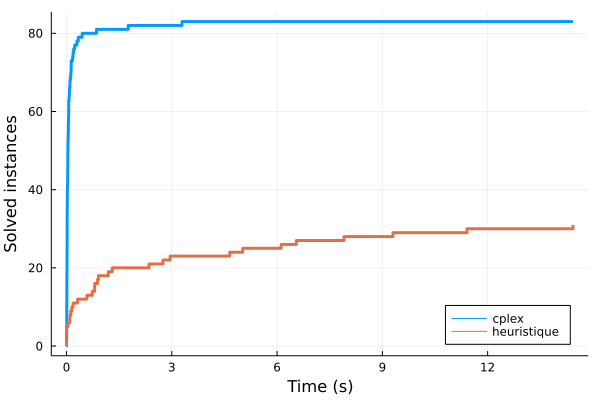
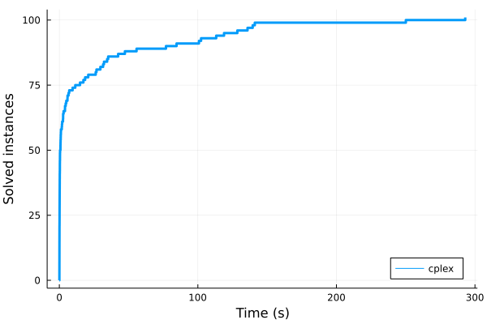

# Projet - RO203

Ziqi MA, Zhuoye YING

## 1 Jeu  - Single

### 1.1 Introduction

Ce jeu est constitué d’une grille de chiffres. La résolution du jeu consiste à noircir certaines cases par exemple :

|          jeu           |         solution         |
| :--------------------: | :----------------------: |
|  |  |

- Règles : Masquer des case de façon à ce que :

  1. aucun chiffre ne soit visible plus d’une fois sur chaque ligne et chaque colonne ;

  2. les cases masquées ne soient pas adjacentes (elles peuvent néanmoins être placées en diagonale) ;
  3. l’ensemble des cases visibles est connexe.

### 1.2 Modélisation du problème

La solution du jeu peut être modélisé par une matrice qui ne contient que $0$ ou $1$, et la taille de cette matrice est la même comme celle du jeu. Par exemple, pour le jeu que nous avons présenté, **les matrices du jeu et de la solution** sont :
$$
\begin{bmatrix}5&4&4&2&3\\3&4&1&5&4\\4&1&2&3&4\\2&1&4&1&3\\1&3&1&4&4\end{bmatrix}\ \ \ \ et\ \ \ \ \begin{bmatrix}1&1&0&1&0\\1&0&1&1&1\\1&1&1&1&0\\1&0&1&1&1\\1&1&0&1&0\end{bmatrix}
$$
Soit $x$ la matrice de la solution et $n$ sa taille

- pour règle n°1 : aucun chiffre ne soit visible plus d’une fois sur chaque ligne et chaque colonne

$$
\forall 1\le i\le n,1\le k\le n\ \sum_{j\in\mathcal{C}_{i,k}}x_{i,j} \le1\\
\forall 1\le j\le n,1\le k\le n\ \sum_{i\in\mathcal{C}_{j,k}'}x_{i,j} \le1
$$

avec $\mathcal{C}_{i,k}=\{m\in\N\ |\ x_{i,m}=k\}$ et $\mathcal{C}'_{j,k}=\{m\in\N\ |\ x_{m,j}=k\}$

- pour règle n°2 : les cases masquées ne soient pas adjacentes

$$
\forall 1\le i\le n-1,1\le j\le n\ \ x_{i,j}+x_{i+1,j}\ge1\\
\forall 1\le i\le n,1\le j\le n-1\ \ x_{i,j}+x_{i,j+1}\ge1
$$

- pour règle n°3 : l’ensemble des cases visibles est connexe

Pour cette règle, on trouve qu'il n'est pas facile de déterminer une relation linéaire comme les deux autres règles. Donc, on utilise la méthode "**Branch and Cut**", c'est-à-dire, on applique les deux premières règles pour optimisation, et puis on vérifie si le résultat de l'optimisation $x$ est connexe ou pas. S'il est connexe, c'est le résultat voulu; sinon, on ajoute le contraint pour la règle n°3 :
$$
\sum_{(i,j)\in Z_x}x_{i,j}\ge1
$$
avec $Z_x=\{(i,j)\in\N^2\ |\ x_{i,j}=0\}$

On refait l'optimisation jusqu'au résultat est connexe.

- pour **l'objectif** du programme linéaire, on cherche tout simplement une solution qui minimise la valeur de la case en haut à gauche : 

$$
\min x_{1,1}
$$

### 1.3 Méthode heuristique

L’heuristique suit les étapes suivantes : On liste les doublons présents dans les lignes et les colonnes.

Par exemple, pour le jeu que nous avons présenté :
$$
\begin{align}
Doublons=\{&[(1,2),(1,3)],\\ &[(2,2),(2,5)],\\ &[(3,1),(3,5)],\\ &[(4,2),(4,4)],...\}
\end{align}
$$
On noircit dans ces listes de doublons autant de cases que nécessaire pour qu’il n’y ait plus de doublons, i.e. que chaque sous liste ne contienne qu’un élément. Pour cela il est nécessaire de s’assurer que les cases que l’on noircit sont admissibles, i.e. qu’elles ne sont pas voisines d’autres cases noires. Ici l’algorithme peut être bloqué. auquel cas on efface tout et on recommence de zéro. Tant que c’est connexe et qu’il reste des cases admissibles et des doublons, on continue, sinon on recommence.

### 1.4 Générateurs d’instances

On génère des instances de taille entre $5$ et $12$. Pour chaque instance, on suit les étapes ci-dessous :

- On génère d'abord une solution : A partir d'une matrice de valeur $1$, on place au hasard des $0$ dans la matrice afin que la matrice vérifie les trois règles.
- Et puis on remplace les $1$ avec les chiffres différents entre $1$ et $n$, dans ce processus, il faut assurer que la matrice vérifie toujours la règle n°2.
- En fin, on remplace les $0$ avec les chiffres déjà présentés dans la même ligne ou colonne

### 1.5 Résultats

D'après le résultat dans le fichier `jeu1/res/array_jeu1.pdf`, on peut conclure que :

Pour la méthode heuristique, elle comporte mieux pour les jeux de petite taille, on trouve que cette méthode peut toujours résoudre le problème si la dimension est inférieur à $6$, mais pour les problèmes dont dimension est supérieur à 8, il est difficile de trouver une bonne solution.

En revanche, pour la méthode cplex, elle fonctionne pour tous les jeux de dimension différente.

## 2 Jeu - Towers

### 2.1 Introduction

Il y a une grille carrée. Sur chaque case de la grille, le joueur peut construire une tour, dont la hauteur varie de 1 à la taille de la grille. Autour du bord de la grille se trouvent des indices numériques.

La tâche est de construire une tour sur chaque case, de telle manière que :

- Chaque ligne contient toutes les hauteurs de tour possibles une fois.
- Chaque colonne contient chaque hauteur de tour possible une fois.
- Chaque indice numérique décrit le nombre de tours qui peuvent être vues si le joueur regarde dans le carré depuis cette direction, en supposant que les tours les plus courtes sont cachées derrière les plus hautes. 

|                       Jeu facile                        |                           Solution                           |
| :-----------------------------------------------------: | :----------------------------------------------------------: |
|  |  |

Dans les puzzles plus difficiles ou plus grands, certaines tours seront spécifiées pour vous ainsi que les indices autour du bord, et certains indices de bord peuvent être manquants.

|                      Jeu difficile                      |                           Solution                           |
| :-----------------------------------------------------: | :----------------------------------------------------------: |
|  |  |

### 2.2 Modélisation du problème

#### 2.2.1 Modélisation

Modéliser la résolution d’une grille de Towers de taille $n$ sous la forme d’un programme linéaire en nombres entiers contenant les variables binaires suivantes : 
$$
\forall \ i\in [|1, \ n|],\ \forall j\in [|1, \ n|],\ 
x_{i,j,k} = 
\left\{
\begin{array}{**lr**}
1, \ si \  x_{i,j} = k
\\
0, \ sinon
\end{array}
\right.
$$
On crée aussi des variables de visibilité dans les quatre directions: 

- Visibilité à gauche:

$$
\forall \ i\in[|1, n |], \ \forall j\in[|1, n|],\ 
vl_{i, j} = 
\left\{
\begin{array}{**lr**}
1, \ si \  cellule \ (i,j) \ est \ visible \ à \ gauche
\\
0, \ sinon
\end{array}
\right.
$$

- Visibilité à droite:

$$
\forall \ i\in[|1, n |], \ \forall j\in[|1, n|],\ vr_{i, j} = 
\left\{
\begin{array}{**lr**}
1, \ si \  cellule \ (i,j) \ est \ visible \ à \ droite
\\
0, \ sinon
\end{array}
\right.
$$

- Visibilité en haut:

$$
\forall \ i\in[|1, n |], \ \forall j\in[|1, n|],\ vu_{i, j} = 
\left\{
\begin{array}{**lr**}
1, \ si \  cellule \ (i,j) \ est \ visible \ en \ haut
\\
0, \ sinon
\end{array}
\right.
$$

- Visibilité en bas:

$$
\forall \ i\in[|1, n |], \ \forall j\in[|1, n|],\ vd_{i, j} = 
\left\{
\begin{array}{**lr**}
1, \ si \  cellule \ (i,j) \ est \ visible \ en \ bas
\\
0, \ sinon
\end{array}
\right.
$$

Les contraints de visibilité sont donnés par le jeu, on les met dans des vecteurs:
$$
\forall \ i \in [|1, n |], \ 
\left\{
\begin{array}{**lr**}
\ vL_{i},\quad Visibilité \ à \ gauche
\\
vR_{i},\quad Visibilité \ à \ droite
\\
vU_{i},\quad Visibilité \ en \ haut
\\
vD_{i},\quad Visibilité \ en \ bas
\end{array}
\right.
$$

#### 2.2.2 Objectif

Comme l’objectif importe peu ici car on souhaite simplement obtenir une solution réalisable, on choisit de maximiser la valeur du premier case.
$$
\max \sum_{k=1}^{n}x_{1,1,k}
$$

#### 2.2.3 Contraints

- Chaque cellule (i, j) doit une valeur k:
  $$
  \forall i \in [|1 , n|],  \ \forall j \in[|1, n|],\ \sum_{k = 1}^{n}x_{i,j,k} = 1
  $$

- Dans une ligne, chaque cellule ne peut que contenir une valeur k:
  $$
  \forall l \in [|1 , n|],  \ \forall k \in[|1, n|],  \sum_{j=1}^{n}x_{l,j,k} = 1
  $$
  
- Dans une colonne, chaque cellule ne peut que contenir une valeur k:
  $$
  \forall c \in [|1 , n|],  \ \forall k \in[|1, n|],  \sum_{i=1}^{n}x_{i,c,k} = 1
  $$

- Il faut aussi satisfaire les contraints de visibilité.

  -  Visibilité à gauche:
    $$
    \forall i \in[|1, n|],\ \forall j \in [|1, n |],\ \forall k \in [|1, n |],\ vl_{i, j}
    \left\{
    \begin{array}{**lr**}
    \leq 1- \frac{\sum_{c=1}^{j-1}\sum_{kp = k}^{n} x_{i,c,kp}}{n}+1-x_{i,j,k}
    \\
    \geq 1- \sum_{c=1}^{j-1}\sum_{kp = k}^{n} x_{i,c,kp} - n \times (1-x_{i,j,k})
    \end{array}
    \right.
    $$

  - Visibilité à droite:
    $$
    \forall i \in[|1, n|],\ \forall j \in [|1, n |],\ \forall k \in [|1, n |],\ vr_{i, j}
    \left\{
    \begin{array}{**lr**}
    \leq 1- \frac{\sum_{c=j+1}^{n}\sum_{kp = k}^{n} x_{i,c,kp}}{n}+1-x_{i,j,k}
    \\
    \geq 1- \sum_{c=i+1}^{n}\sum_{kp = k}^{n} x_{i,c,kp} - n \times (1-x_{i,j,k})
    \end{array}
    \right.
    $$

  - Visibilité en haut:
    $$
    \forall i \in[|1, n|],\ \forall j \in [|1, n |],\ \forall k \in [|1, n |],\ vu_{i, j}
    \left\{
    \begin{array}{**lr**}
    \leq 1- \frac{\sum_{l=1}^{i-1}\sum_{kp = k}^{n} x_{l,j,kp}}{n}+1-x_{i,j,k}
    \\
    \geq 1- \sum_{l=1}^{i-1}\sum_{kp = k}^{n} x_{l,j,kp} - n \times (1-x_{i,j,k})
    \end{array}
    \right.
    $$

  - Visibilité en bas:
    $$
    \forall i \in[|1, n|],\ \forall j \in [|1, n |],\ \forall k \in [|1, n |],\ vu_{i, j}
    \left\{
    \begin{array}{**lr**}
    \leq 1- \frac{\sum_{l=i+1}^{n}\sum_{kp = k}^{n} x_{l,j,kp}}{n}+1-x_{i,j,k}
    \\
    \geq 1- \sum_{l=i+1}^{n}\sum_{kp = k}^{n} x_{l,j,kp} - n \times (1-x_{i,j,k})
    \end{array}
    \right.
    $$

### 2.3 Générateurs d’instances

On génère des instances de taille $n$, pour chaque instance, on suit les étapes ci-dessous :

- **Jeux avec solution**: on génère d'abord une solution de taille $n\times n$. À partir de la solution, on gère les vecteurs de visibilités. et avec ceux, on génère des jeux.
- **Jeux sans solution**: on génère les vecteurs de visibilité arbitrairement. À partir des visibilités, on génère des jeux sans solution.
- **Mode normal**: dans un mode normal, on a une probabilité de 20% de générer des jeux sans solution. 
- **Mode difficile**: dans un mode difficile, tous les jeux possède une solution, mais chaque cellule de visibilité ont une probabilité de 50% de disparation. et $\frac{n}{2}$ tours sont données dans une position arbitraire.

### 2.4 Résultat

D'après le résultat dans le fichier `jeu2/res/array_jeu2.pdf`, on trouve que le méthode cplex peut toujours résoudre le problème si la dimension est inférieur à $10$, mais pour les problèmes dont dimension est supérieur à $10$, il existe des cas qui sont difficiles de trouver une solution.

